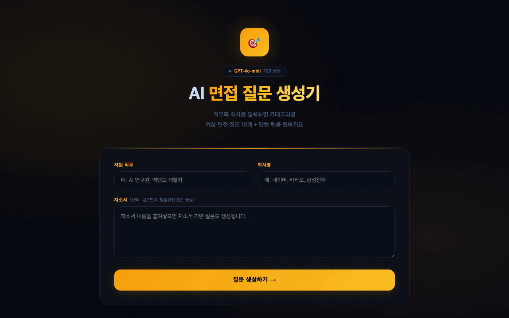

# 🎤 Interview Coach

> GPT-4o-mini 기반 AI 면접 질문 생성기

직무와 회사명을 입력하면 AI가 맞춤형 면접 예상 질문 10개를 카테고리별로 생성해줍니다.

## 📸 Demo



## 🛠️ 기술 스택

| 분류 | 기술 |
|------|------|
| LLM | OpenAI GPT-4o-mini |
| Backend | FastAPI |
| Frontend | Vanilla JS |
| Deploy | Render |

## 🚀 실행 방법

```bash
git clone https://github.com/sauuri/interview-coach
cd interview-coach
python3 -m venv .venv
source .venv/bin/activate
pip install -r requirements.txt
cp .env.example .env
# .env 파일에 OPENAI_API_KEY 입력
uvicorn app.main:app --reload
```

브라우저에서 `http://localhost:8000` 열기

## 🔗 Live Demo

[https://interview-coach-1-1htt.onrender.com](https://interview-coach-1-1htt.onrender.com)
